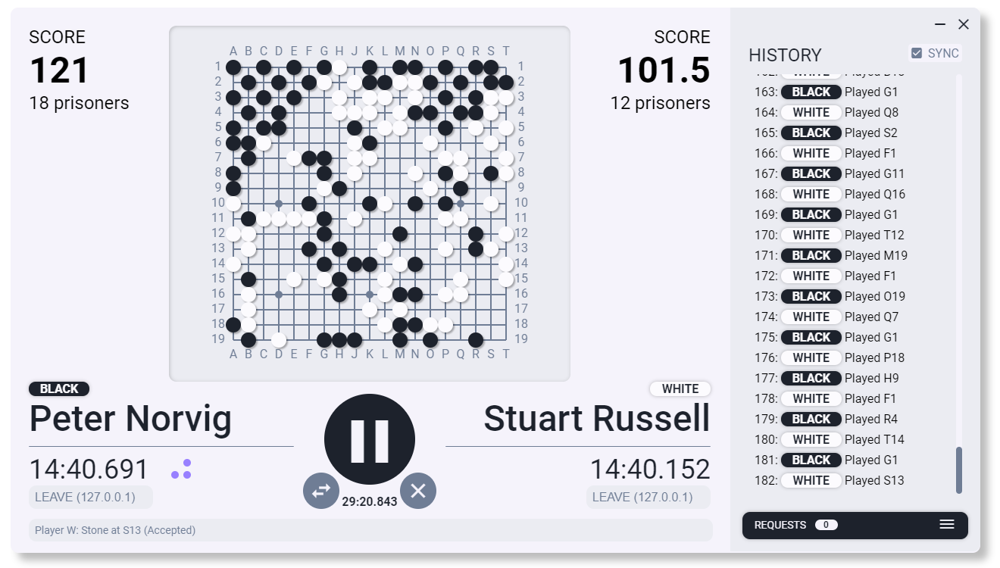

# Go-Server

> Go Server is a 2-Player Websockets Go Judging Server. This project is made for the Fall 2019 Machine Intelligence Course (CMPN402/CMP402A) in Computer Engineering Program at Cairo University Faculty of Engineering.

The server uses Websockets protocol version 13 as defined by RFC6455 (https://tools.ietf.org/html/rfc6455)

Communication Details can found in [this document](docs/protocol.pdf).

You can download a binary version for Windows from [Releases](https://github.com/yahiaetman/Go-Server/releases).

**WARNING:** When running the server, place it in a folder where it has permission to create folders and write files. This permission is needed to save logs and checkpoints.

## How to run and build

### Before running or packaging the server:

- To install the dependencies, run: `yarn install`.
- To build the main and rendering threads, run: `yarn production` (See [Parceljs](https://parceljs.org/) for more options).

### To run the server or an example:

- To run the server, run: `yarn start`.
- To run the console client, run: `yarn console:client [name] [address=ws://localhost:8080]`.

### Additional Options

- To run the server on the console, run: `yarn console:server`.
- To run a silly greedy agent, run: `yarn console:silly-agent`.
- To play go-game only (offline), run: `yarn console:go`.
- To package the server for distribution, run: `yarn dist`.
- To run tests, run: `yarn test`.
- To build the main and rendering threads in watch mode, run: `yarn watch:main` and `yarn watch:renderer` each in a separate terminal.

## Configuration

Server configuration is found in `server.config.json`, which contains the following configurations:

- `host`: can be `127.0.0.1` if the server and the client are on the same machine (useful for debugging) and must be `0.0.0.0` if the clients will run on a seperate machine (**NOTE:** you can get your machine's ip on the local network using `ipconfig`).
- `port`: defines the port to which the server will listen.
- `ping interval`: defines the time interval for the ping/pong handshake in the heartbeat system (Format: `MM:ss.s`).

Game configuration is found in `game.config.json`, which contains the configuration described in the [Communication Protocol Document](docs/protocol.pdf). You can edit the game configuration file and the server will automatically detect the changes without restarting.

## How to use the Server

After running the server, run 2 clients then choose the clients to join the game from the requests list. After picking the players, press *Play*. If there is a saved checkpoint, you can press *Clear* to clear the checkpoint and return to the configuration found in `game.config.json`. If you press *Pause*, you can continue the game later.

## How to use the Console Client

Run: `yarn console:client [name] [address=ws://localhost:8080]`. If the client and server are on the same device, you can use the default host (`localhost`). Otherwise, you need to find the Server IP by running `ipconfig` on the host machine. 

The client can play their turn using on of the following commands:

- `pass`
- `resign`
- `place <point>` where:
	- `point` is written in the form: `column` and `row`.
    - `column` can be a letter from **A** to **Z** except **I** and `row` can be a number from **1** to **25**.
    - For example, the upper left point in the board will always be **A1**.
- Other commands: `help` and `exit`.

## How to use the Console Server

Run: `yarn console:server`. 

The server can manage the game using on of the following commands:

- `view <state | clients>` to view the game state or the clients list.
    - `state` will display the game board, scores, time, and turn.
    - `clients` will display the connected clients with their names, addresses and automatically assigned IDs. A list of selected players will also be shown.
- `join <client-id> <color>` to add a client to the game as a player where `color` is either `B` or `W`.
- `leave <client-id>` to remove the client from the players' list.
- `disconnect <client-id>` to forcefully disconnect a client from the server.
- `swap` to swap the colors of the players.
- `start` to start a game from the current state.
- `stop` to pause the game.
- `clear` to discard the checkpoint and set the current state to match `game.config.json`.
- Other commands: `help` and `exit`.

## License
The project is available as open source under the terms of the [MIT License](LICENSE).
